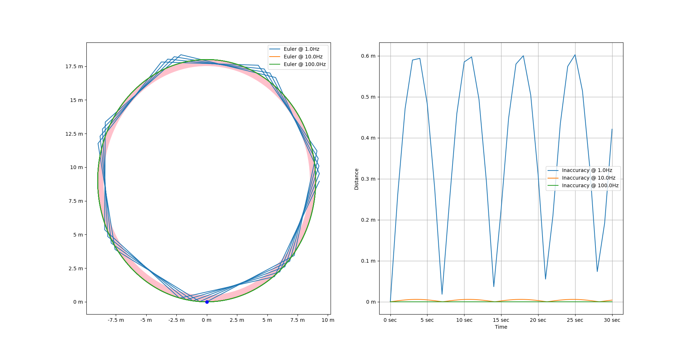

# Problem 2
## Part A
### Requirements
> 1. Traverse along the edge of an 18m radius circle.
> 2. The robot starts off in the center of the circle (0,0).
> 3. Plot the resulting path (x, y) and trajectory (x, y, and angular velocities).
> 4. Assume a constant velocity of 8m/s.

### Methods
[Part A Code here](./2a.py)

1. Do math to figure out a circle of half the total radius, and the desired steering angles to keep us on each different circle
2. Set the desired steering angle to put us on that circle
3. Use a time step less than the maximum of 2Hz, calculated such that we will be on the outer, desired circle when calculation occurs
    - Though allowing use of a slower time step is not specified as allowed in the question, it was cleared by Dr. Mario
4. When we reach the outer circle, use the steering angle that puts us on the outer circle

Modelling uses circle math with our current steering angle as opposed to `velocity*time` to determine our position.

### Results

## Part B
### Requirements
> Do the same as the above for an equivalent skid-steer vehicle.

### Methods
[Part B Code here](./2b.py)

Same as above, but instead wait until we get close, then use a stronger 'steering angle'. There is no maximum steering angle, so we can turn right as we're about to get there.

### Results

## Part C
### Requirements
> 1. Drive on a circle of radius 9m. Assume that you begin on the edge of the circle.
> 2. Calculate the positional error with our computational approximation using the forward Euler method.
> 3. Graph the errors and computing time for three different time-steps (∆t = 1, 0.1, 0.01).

### Results

