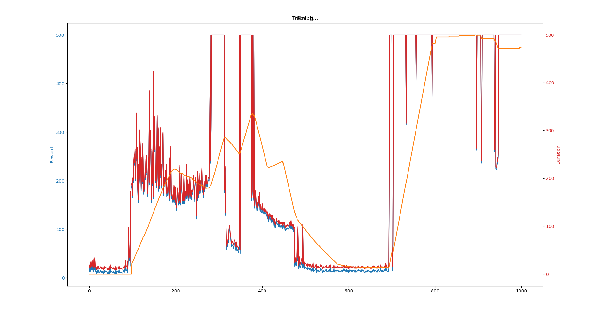
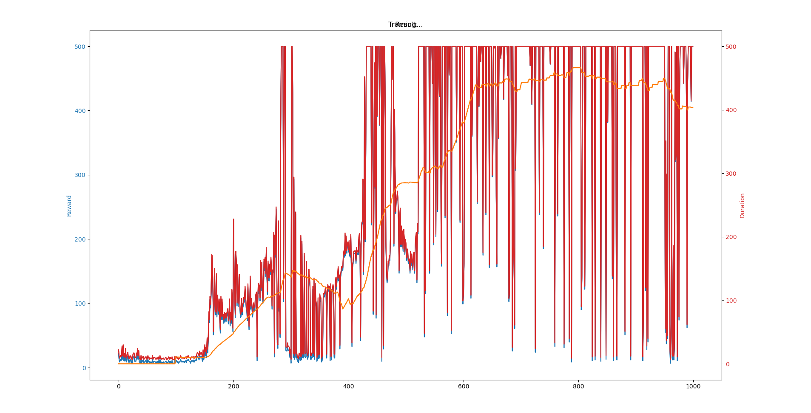
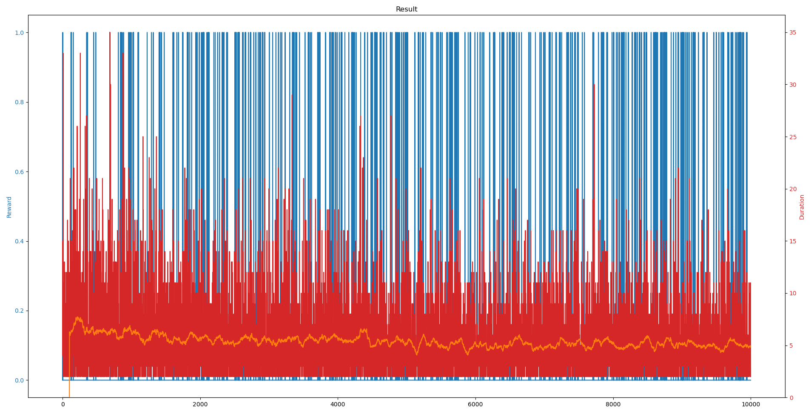
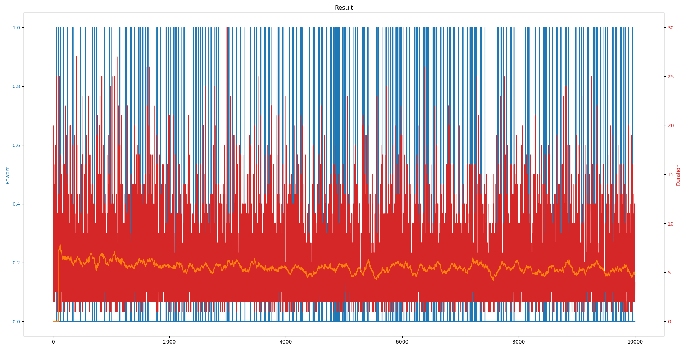

# Question 5
## Part A
Explain three merits and three demerits of using reinforcement learning for mechatronic systems.

Merits
 1. Finds patterns that a programmer may not
    - In complex systems, traditional controls may struggle to model the numerous, multi-dimensional, highly-interrelated, and often mathematically-expensive data points. Reinforcement learning innately takes these into account without a second thought.
 2. Adaptable, should you desire it
    - Given new data, the programmer may designate the actions taken as "good" or "bad", and thus train the system to perform well even in situations not originally intended.
 3. Answering unanswerable questions
    - While traditional controls require predefined rule sets, reinforcement learning allows the system to experimentally discover optimal strategies, even in areas of uncertainty.

Demerits
 1. Cannot handle novel situations
    - Situations not present in the training dataset yield undefined behavior.
    - Struggles heavily with randomness
 2. Prone to overfitting
    - A model trained in a simulated environment may fail to translate that into the real world.
 3. Not explainable
    - Reinforcement learning is very much a black box; there is no explanation given for the decision made other than "that's what the math said."

## Part B
Draw a diagram for reinforcement learning and controls and contrast the two

### Reinforcement Learning
```
+-------------------+
|    Environment    | <-------+
+----+----------+---+         |
     |          |             |
   State      Reward        Action
     |          |             |
     v          v             |
+-------------------+    +----+-----+
|       Agent       +--> |  Policy  |
+---------+---------+    +----------+
```

### Controls
```
+-------------------+
|    Environment    | <---Take-Action---+
+---------+---------+                   |
          |                             |
     Actual State                       |
          |                             |
          v                             |
+-------------------+                   |
| Environment Model | <-Expected-Change-+
+---------+---------+                   |
          |                             |
    Desired Change                      |
          |                           Action
          v                             |
+-------------------+                   |
|    Controller     +-------------------+
+-------------------+               
```

### Contrast
Reinforcement Learning
 - Goal: Learn a policy to maximize cumulative rewards over time.
 - Training: Interact with the environment, typically via trial and error.
 - Feedback: Rewards or penalties from the environment.
 - Model: Environment can be a model of the true environment, or raw data.

Control Systems
 - Goal: Regulate a system to achieve and maintain a desired state or output.
 - Training: Typically designed and tuned based on mathematical models and system analysis.
 - Feedback: Sensors compare actual performance with the expected performance (drift).
 - Model: Relies on a mathematic or other system model.

## Part C
See [output files](./5c/out). Includes saved pytorch files.

Note: [ML code](./5c/learn_env.py) modified from the [PyTorch Reinforcement Learning (DQN) Tutorial](https://pytorch.org/tutorials/intermediate/reinforcement_q_learning.html) to support both CartPole and FrozenLake.

### CartPole
`python3 -m 5c CartPole-v1 --render`


### CartPole Modified
`python3 -m 5c CartPoleMod-v1 --render`


### FrozenLake
`python3 -m 5c FrozenLake-v1 --render`


### FrozenLake Modified
`python3 -m 5c FrozenLakeMod-v1 --render`


### Running the code yourself
```
Usage: python3 -m 5c [preset] [--render|--preset|--out|--episodes]

Positional Arguments:
  preset (default: CartPole-v1)
    This flag sets what environment should be created and trained against.
    For the sake of this question, the relevant presets are:
      CartPole-v1
      CartPoleMod-v1
      FrozenLake-v1
      FrozenLakeMod-v1

Flags:
  --render [mode] (default: None)
      Including this flag without specifying a mode will set a render mode of "human".
  --preset <id> (default: CartPole-v1)
      Alias for the positional argument preset
  --out <path> (default: model.pth)
      Where the model, once trained, should be saved
  --episodes <n> (default: 1000)
      The number of episodes for which to train the model
  --<ARG> [VALUE] [VALUE...]
      Sets the keyword argument when creating the environment
      If no values are provided (--<ARG>):
        ARG=True
      If one value is provided (--<ARG> <VALUE>):
        ARG=VALUE
      If more values are provided (--<ARG> <VALUE> <VALUE> <...>):
        ARG=[VALUE, VALUE, ...]

Environment-specific
  CartPoleMod-v1:
    --left_multiplier (default: 1)
        Multiplier for the force when going to the left
    --right_multiplier (default: 2)
        Multiplier for the force when going to the right

  FrozenLake-v1:
    --map_name [map_name]
        Use a preloaded map
        If not provided, generates a random 8x8 map with 80% of locations frozen
    --is_slippery
        Sets the environment variable "is_slippery" to True
    --not_is_slippery
        Sets the environment variable "is_slippery" to False

  FrozenLakeMod-v1:
    --map_name [map_name]
        Use a preloaded map
        If not provided, generates a random 8x8 map with 80% of locations frozen
    --is_slippery
        Sets the environment variable "is_slippery" to True
    --not_is_slippery
        Sets the environment variable "is_slippery" to False
    --death_probability <probability> (default: 0.02)
        The probability that the agent will randomly die of cold

```

