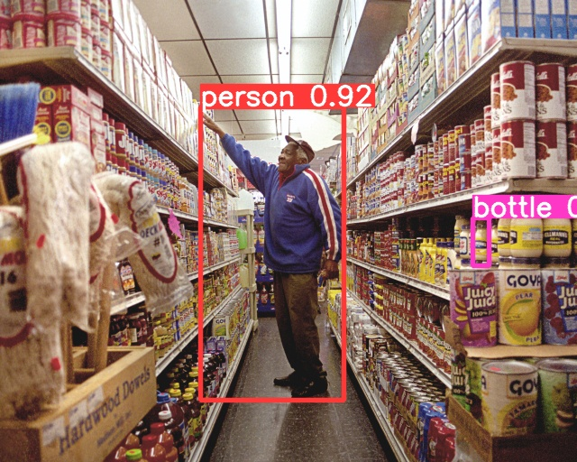

# (a) SSD
Using Single-Shot Detector (SSD) in [ssd.py](ssd.py) and the [grocerystore](/grocerystore/) images outputted into [ssd](/ssd/)
SSD-Examples                                 | SSD-Examples 
:-------------------------------------------:|:----------------------:
                         | 
                  | 

# (b) YOLO v8 & YOLO v5 (Both Ultralytics)
YOLO v8                                                |  YOLO v5
:-----------------------------------------------------:|:----------------------:
                                 | 
                        | 
      | 
                               | 
                   | 
                                   | 
                         | 
                                 | 
                                | 

# (c) YOLOv8n Desktop vs Pi

## Desktop (32GB RAM, i9-10900KF, RTX 3080)
Average FPS: 85.24

Average CPU Usage: 13.86%

Average GPU Usage: 21.02%

## Pi 4B 4GB RAM
Average FPS: 0.93

Average CPU Usage: 84.31%

# (d) Mask R-CNN vs Faster R-CNN vs RetinaNet

[Colab Tutorial](https://colab.research.google.com/drive/16jcaJoc6bCFAQ96jDe2HwtXj7BMD_-m5)

### Mask R-CNN

### Faster R-CNN

### RetinaNet

